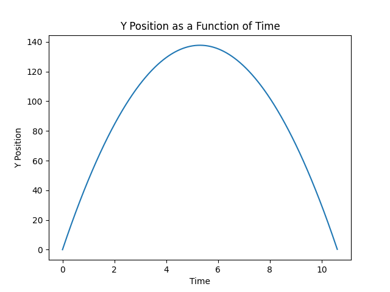
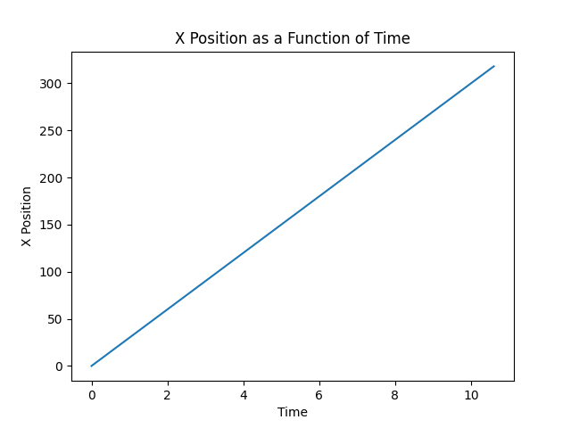
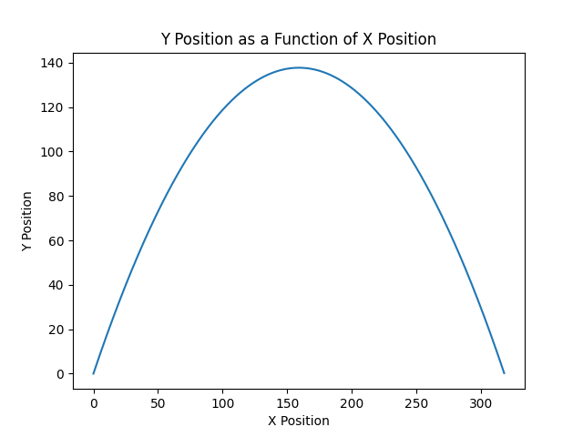
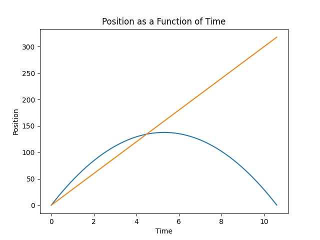

# Python Physics Calculator
##### Author: Cyan Brown
***
#### Starting Notes
***
* gravitational acceleration is 9.8
* air resistance considered negligible
* There are some random errors that I am working out
***
#### Physics Class
***
##### Params:
###### *All params are integer or float
* A (acceleration)
* T (total time)
* V0 (velocity initial)
* V (velocity final)
* X0 (position initial)
* X (position final)
* vector (list) (required for projectile)
    * Index 0 - magnitude of vector
    * Index 1 - degrees or radians from x axis
* round_to (int) (asummed 3) = set how many decimal places to round to
* measure (str) (degree mode assumed) - deg for degree, rad for radian

### Examples
***
Y to Time             |  X to Time           
:--------------------:|:--------------------:|
 |  

Y to X                |Y and X to Time
:--------------------:|:--------------------:|
|
[More Examples](https://github.com/CyanBrown/PhysicsCalculator/tree/master/examples)

### Known Issues
* You cannot add custom kinematic values for projectiles, it only works with vectors alone
